# Módulo Estilos e Padrões Arquiteturais

## 1. Histórico de Versões

| Versão | Mensagem                   | Autor        | Data       |
|--------|----------------------------|--------------|------------|
| 1.0    | Criação do Documento       | Rafael e João| 14/01/2023 |
| 1.1    | Adição da Visão de Dados   | Cristian, João e Rafael| 19/01/2023|
| 1.2    | Edita escopo e acrescenta tópicos 2.1.1 e adiciona indicação de demais tópicos do DAS  | Cristian e Rafael | 19/01/2023 |
| 1.3    | Edita ordem de alguns tópicos e acrescenta conteúdo nos tópicos 2.8 e 2.9 | Cristian | 24/01/2023 |
| 1.4    | Alterar ordem dos itens após Visão Implantação e Implementação e Introdução destes tópicos | Rodrigo | 26/01/2023 |
| 1.5    | Adiciona imagem em tópico 2.1.2, adiciona conteúdo nos tópicos visão lógica, processos e qualidade e adiciona novas referências | Cristian e Rodrigo |  26/01/2023 |
| 1.6   | Ajuste do diagrama de ativiades | Rafael e João | 27/01/2023 |
| 1.7   | Ajuste do diagrama de classes | Victor Yukio, Rafael e João | 28/01/2023 |
| 1.8 | Adicionar visao de implementação e pequenas correções | Victor Yukio, João, Rodrigo | 28/01/2023 |
| 1.9 | Adição do diagrama de implantação v2 e Diagrama de componentes | Rafael e Fernando  | 28/01/2023|
| 1.10 | Adição do diagrama de pacotes v2 superficial e backend| Fernando e Levi | 30/01/2023|
| 1.10 | Adição do diagrama de pacotes v2 frontend | Fernando e Levi | 30/01/2023|

## 2. DAS

### 2.1. Introdução

Neste documento são tratdas decisões arquiteturais tomadas pelo grupo. Ele é composto por:
1. **Visão lógica**, voltada para apresentar a divisão dos pacotes, sistemas, classes e seus relacionamentos;
2. **Visão de implementação**, focada mais nos padrões e modelos utilizados no momento de fazer a implementação do projeto;
3. **Visão de implantação**, traz uma ideia de em qual(is) hardwares o software seria implementado;
4. **Visão de dados**, com a perspectiva de armazenamento dos dados, a camada de persistência da aplicação.

#### 2.1.1. Propósito

Este documento apresenta uma visão geral de como o sistema está projetado, descrevendo os seus padrões e detalhes arquiteturais utilizados quanto os requisitos e escopo do projeto. Portanto, este documento é muito relevante para a equipe de desenvolvimento, pois eles irão se basear e se orientar a partir dele.

#### 2.1.2. Escopo

O projeto **SpotHood**, trabalho da disciplina de Arquitetura e Desenho de Software(ArqDSw), é voltado para facilitar a gerência e comunicação de moradores em um **condomínio residencial**. Este trabalho terá o formato de uma aplicação web, em que uma pessoa pode logar como morador ou síndico. O morador pode verificar avisos, e realizar uma reserva de uma área comum (piscina, salão de festa, churrasqueria, entre outros) se houver. O síndico além de exercer as mesmas funções de um morador, ele poderá cadastrar avisos e áreas comuns, em que os moradores farão suas reservas de uso.

Pode-se entender um pouco do tema do projeto utilizando a imagem abaixo, que foi o mapa mental desenvolvido pelo grupo na fase inicial (de requisitos) do projeto:

<h6 align='center'>Figura 1: Mapa Mental</h6>
<object data="../assets/mapa_mental/mapaMental.pdf" type="application/pdf" width="700" height="700">
    <embed src="../assets/mapa_mental/mapaMental.pdf">
    </embed>
</object>
<h6 align='center'>Fonte: Autoria do grupo</h6>

#### 2.1.3. Definições, Acrônimos e Abreviações

| Abreviação/Acrônimo| Definição    |
| ------------------ | ------------ |
| SQL - Standard Query Language | Linguagem de pesquisa declarativa padrão para banco de dados relacional  |
| SGBDR - Sistema Gerenciador de Banco de Dados Relacional               | Software responsável pelo gerenciamento do banco de dados relacional                       |
| GRASP - General Responsibility Assignment Software Patterns | Diretrizes para atribuir responsabilidade a classes e objetos em projeto orientado a objetos                      |
| GOF - Gang of Four    | Um tipo de padrão de projeto para auxiliar na criação de um software|

### 2.2. Representação Arquitetural

#### 2.2.1. Back-End

O grupo optou por utilizar no Back-End o **DJAngo**, que é um software livre e um framework web Python de alto nível que permite o rápido desenvolvimento de sites seguros [1]. O motivo de escolha dessa tecnologia deve-se pelo fato de alguns membros conhecerem muito bem o framework. Além disso, ele torna mais fácil manutenabilidade do código.

#### 2.2.2. Front-End

O grupo optou por utilizar no Front-End o **React** que é uma biblioteca JavaScript de código aberto com foco em criar inferfaces de usuário em páginas web. O motivo de escolha dessa tecnologia deve-se pelo fato de alguns membros conhecerem muito bem o framework. Além disso, ele permite a reutilização de código e a componetização, o que torna o desenvolvimento menos complexo e reduz o tempo de codificação e manutenção.

#### 2.2.3. Banco de Dados

Para o banco de dados utilizamos do Postgres v.11 que é um sistema de gerenciamento banco de dados, que utiliza da linguagem SQL. É um SGBDR de código aberto muito utilizado pela comunidade e também com muita ajuda para resolução de conflitos e problemas online.

### 2.3. Metas e Restrições de Arquitetura

#### 2.3.1. Metas

| Restrições     | Descrição                                             |
| ------------- | ---------------------------------------------------------------- |
| Segurança | O sistema deve garantir a integridade e segurança dos dados coletados pela aplicação, sempre validando qualquer nova entrada |
| Usabilidade | O sistema deve proporcionar maior conforto e facilidade ao usuário quando este requisita suas funcionalidades |
| Suportabilidade | O sistema deve funcionar primariamente para desktops e notebooks e rodar nos navegadores web nas suas atualizações mais atuais |
| Escalabilidade | O sistema deve permitir que novas evoluções sejam implementadas conforme o desejado |

#### 2.3.2. Restrições

| Restrições     | Descrição                                             |
| ------------- | ---------------------------------------------------------------- |
| Cadastro de Contas | Não poderão ser criadas contas com cpfs que já estejam vinculados a uma conta existente |
| Cadastro de Condomínios | Não poderão ser criados condomínios com cnpjs que já estejam vinculados a outro condomínio existente na plataforma |
| Limite de imóveis | Um morador não pode ter mais de um imóvel dentro do condomínio |
| Conectividade | É necessário ter conexão com a internet para utilizar a aplicação.                                                |
| Idioma        | O sistema deve ser desenvolvido para o idioma português do Brasil.                                                |
| Público       | O projeto deve ser desenvolvido para pessoas que desejam ter um melhor controle e conhecimento sobre o que está acontecendo no condomínio onde mora|
| Plataforma    | A aplicação será utilizada em plataformas web, tais como Google Chrome, FireFox, Brave, entre outros.      |
| Prazo Final   | O escopo do projeto deve ser finalizado até o final da disciplina.   |

### 2.4. Visão Lógica
A visão lógica da arquitetura revela detalhes, como o nome diz, sobre a estruturação lógica dentro de um projeto, mostrando detalhes das entidades presentes dentro de um sistema, bem como como estas relacionam entre si e de que forma estão organizadas dentro da aplicação[2]. Esta visão pode ser descrita a partir de alguns artefatos como o diagrama de classes, pacotes e de comunicação, em que fica explícita a descrição e organização das classes no projeto e o comportamento de seus objetos dentro do sistema.

#### 2.4.1. [Diagrama de Classes](/Modelagem/2.1.1.diagramaDeClasses?id=_3-diagrama)

No diagrama de classes temos uma visão mais detalhada do que é composto cada classe (métodos e atributos) e a forma como cada uma se relaciona dentro da aplicação, sendo a visão lógica mais perto do próprio código em si.
Devido a falta de conhecimento das regras de negócio, a modelagem passou por reformulaçao com umas abordagem mais simples. E chegamos ao seguinte resultado

<h6 align='center'>Figura 2: Diagrama de Classes</h6>

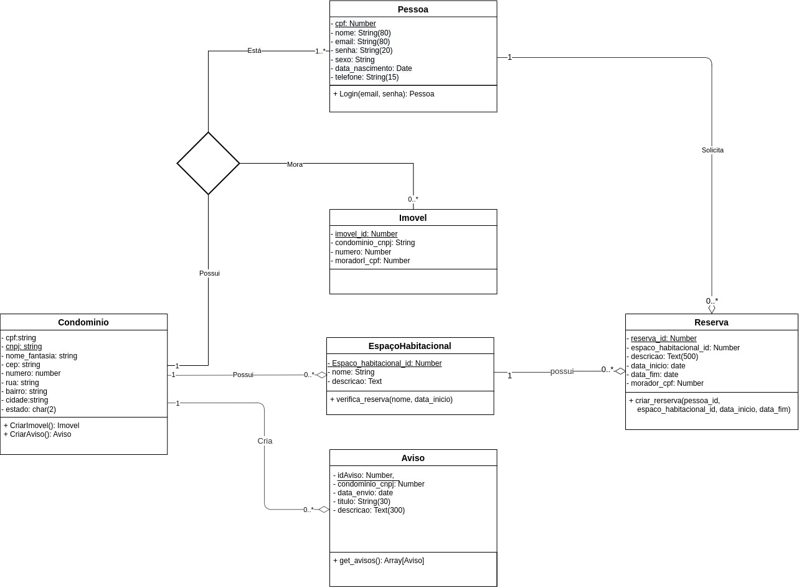

<h6 align='center'>Fonte: Autoria do grupo</h6>

#### 2.4.2. [Diagrama de Pacotes](/Modelagem/2.1.3.diagramaDePacotes?id=diagrama-de-pacotes)

No diagrama de pacotes é possível ver a forma que os pacotes (ou pastas) estão organizadas dentro do projeto, sendo possível observar também do que está sendo composto as camadas do front-end e do back-end.

<h6 align='center'>Figura 3.1: Diagrama de Pacotes Superfical</h6>
<h6 align='center' width='50' heigth='50' src= >
    
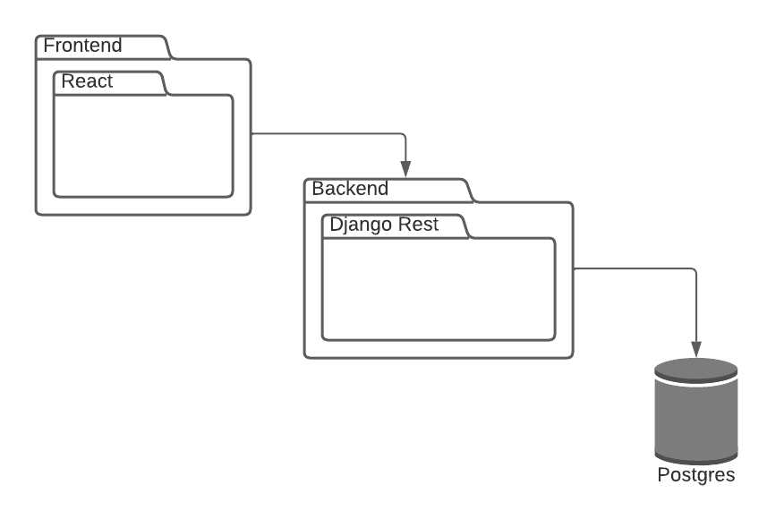

</h6>
<h6 align='center'>Fonte: Autoria do grupo</h6>

<h6 align='center'>Figura 3.2: Diagrama de Pacotes Frontend</h6>
<h6 align='center' width='50' heigth='50' src= >
    
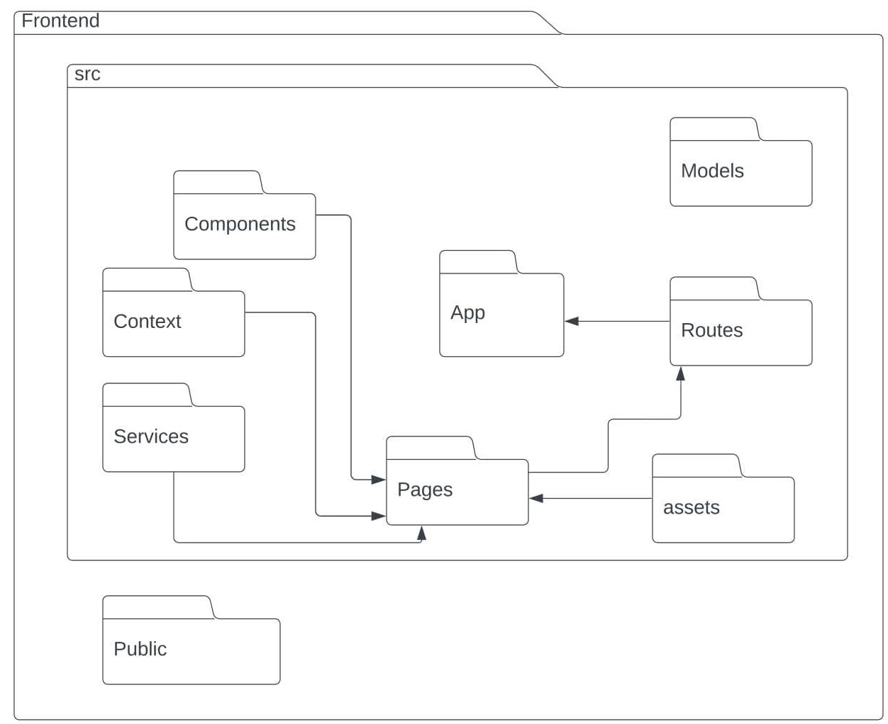
    
</h6>
<h6 align='center'>Fonte: Autoria do grupo</h6>

<h6 align='center'>Figura 3.3: Diagrama de Pacotes Backend</h6>
<h6 align='center' width='50' heigth='50' src= >
    
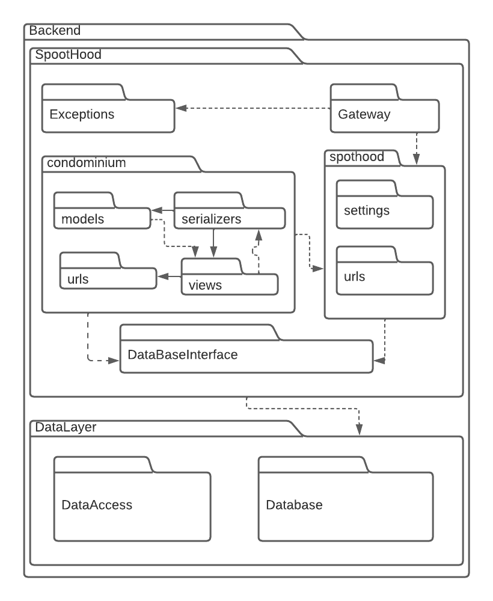
    
</h6>
<h6 align='center'>Fonte: Autoria do grupo</h6>

#### 2.4.3. [Diagrama de Comunicação](/Modelagem/2.1.2.DiagramaDeComunicacao.md?id=diagrama-de-comunicação)

Os diagramas de comunicação aqui explicitam a sequência lógica de atividades que atores do sistemas irão executar dentro da aplicação, que no caso seriam os atores Morador e Síndico.

<h6 align='center'>Figura 4: Diagrama de Comunicação - Visão Morador v2.</h6>
<h6 align='center'>Figura 3.2: Diagrama de Pacotes Backend</h6>
<h6 align='center' width='50' heigth='50' src= >
    
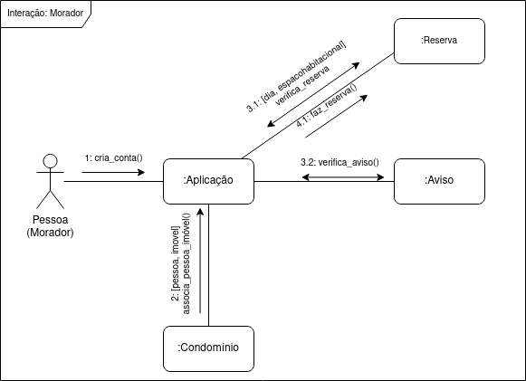
    
</h6>

<h6 align='center'>Fonte: Autoria do grupo</h6>

<h6 align='center'>Figura 5: Diagrama de Comunicação - Visão Síndico v2.</h6>

<h6 align='center'>Figura 3.2: Diagrama de Pacotes Backend</h6>
<h6 align='center' width='50' heigth='50' src= >
    
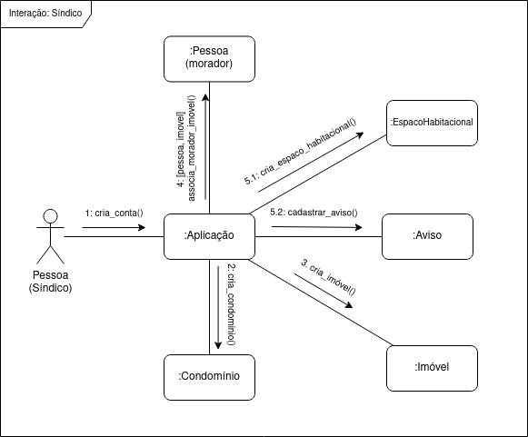
    
</h6>

<h6 align='center'>Fonte: Autoria do grupo</h6>

### 2.5. Visão de Processos

A visão de processos descreve a forma e o tempo que processos e o que eles desencadeam (outros processos) dentro do sistema em que são executados, sendo voltada para se observar aspectos da aplicação como simultaneidade e tolerância a alhas.[3] Para se ter essa visão, pode-se utilizar os diagramas de atividades e de sequência.

#### 2.5.1. [Diagrama de Atividades](Modelagem/2.1.2.DiagramaAtividades.md?id=diagrama-de-atividades)

<h6 align='center'>Figura 6: Diagrama de Atividades Cadastro de Conta v2 </h6>
<h6 align='center' width="200" height="200">

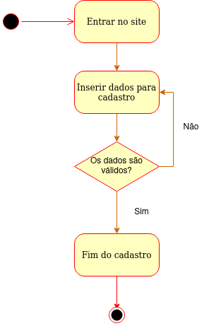

</h6>
<h6 align='center'>Fonte: Autoria do grupo</h6>

<h6 align='center'>Figura 7: Diagrama de Atividades de Avisos </h6>
<h6 align='center' width="200" height="200">

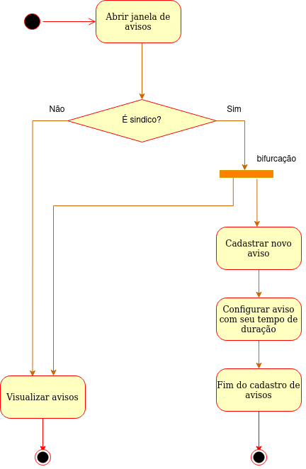

</h6>
<h6 align='center'>Fonte: Autoria do grupo</h6>

<h6 align='center'>Figura 8: Diagrama de Atividades de Reservas v2</h6>
<h6 align='center' width="200" height="200">

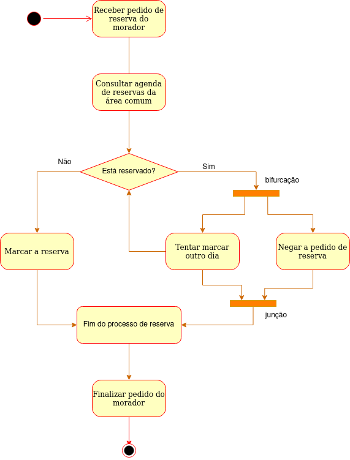

</h6>
<h6 align='center'>Fonte: Autoria do grupo</h6>

#### 2.5.2. [Diagrama de Sequência](/Modelagem/2.1.2.DiagramaDeSequencias.md?id=diagrama-de-sequência)

<h6 align='center'>Figura 9: Diagrama de Sequência 1</h6>

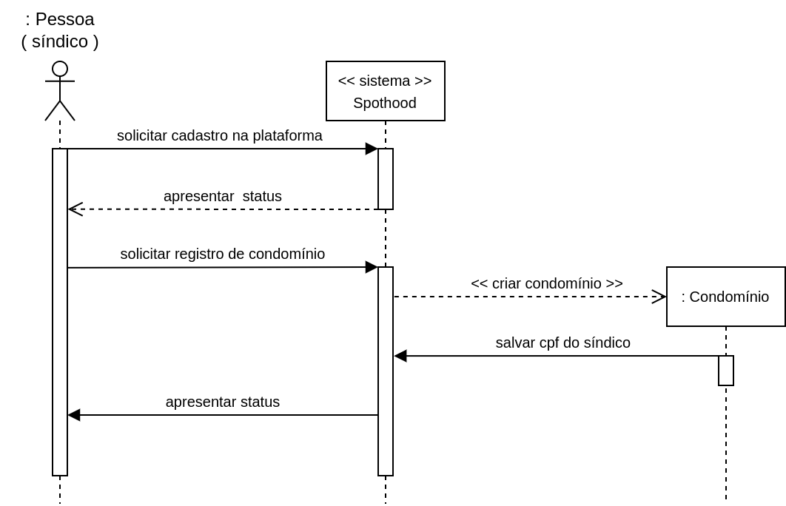

<h6 align='center'>Fonte: Autoria do grupo</h6>

<h6 align='center'>Figura 10: Diagrama de Sequência 2</h6>

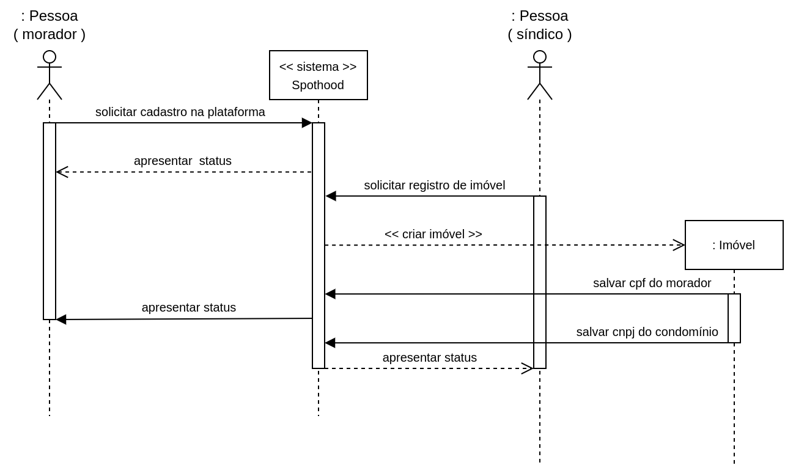

<h6 align='center'>Figura 11: Diagrama de Sequência 1</h6>

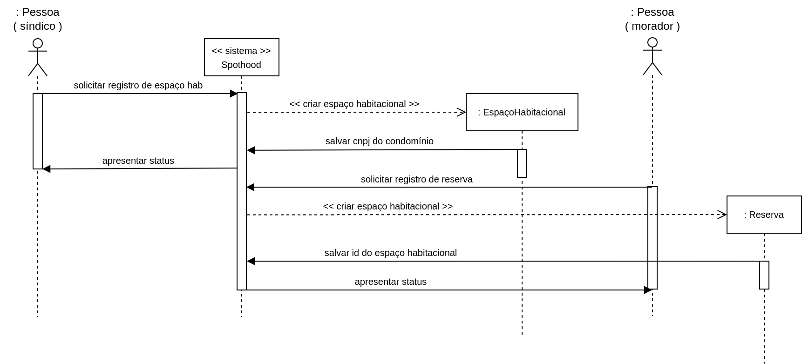

<h6 align='center'>Fonte: Autoria do grupo</h6>

<h6 align='center'>Figura 12: Diagrama de Sequência 2</h6>

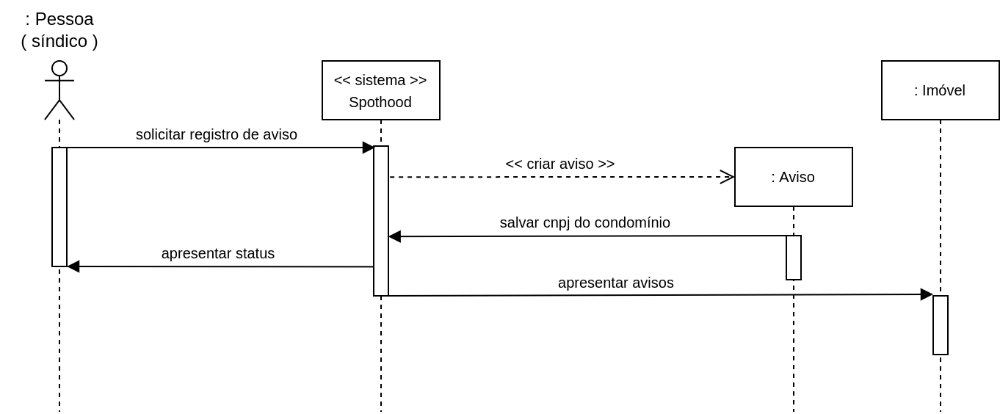

<h6 align='center'>Fonte: Autoria do grupo</h6>

### 2.6 Visão de Implementação

Um diagrama de implantação de um aplicativo de condomínio pode incluir vários componentes, dependendo das funcionalidades incluídas no aplicativo. Alguns dos componentes comuns que podem ser incluídos são:

Um aplicativo Django com React em um ambiente de desenvolvimento local (localhost) envolve a configuração de dois servidores separados: um para o backend Django e outro para o frontend React. O backend Django gerencia as rotas da API e acessa o banco de dados, enquanto o frontend React é responsável por apresentar a interface do usuário e fazer chamadas à API do backend. As duas partes do aplicativo se comunicam através de chamadas HTTP, como GET, POST, PUT e DELETE.

Uma vez configurado, o aplicativo pode ser acessado através do endereço localhost:8080/ para o frontend React e localhost:8001/ para o backend Django.

O Software está implementado apenas em ambiente de desenvolvimento, ou seja, possuimos um banco de dados, um aplicativo WeB, Servidor (Computadores pessoais).
Para maior estabilidade e agilidade no desenvolvimento do projeto fizemos a utilização de contêineres do banco de dados, backend e  frontend. Tudo é executado e alocado em um servidor local na própria máquina do usuário.

#### 2.6.1 [Diagrama de Implantação](/Modelagem/2.1.1.DiagramaImplantacao.md?id=diagrama-de-implantação)
<h6 align='center'>Figura 13: Diagrama de Implantação v3.</h6>
<h6 align='center'>

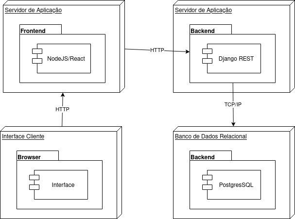

</h6>
<h6 align='center'>Fonte: Autoria do grupo</h6>

### 2.7 Visão de Implementação
O Software está implementado apenas em ambiente de desenvolvimento, no qual os contêineres de banco de dados, backend e frontend, são executados e alocados em um só servidor, assim podendo simular a navegação de um usuário pelo navegador.

#### 2.7.1 [Diagrama de Componentes](/Modelagem/2.2.1.DiagramaDeComponentes.md?id=diagrama-de-componentes)

<h6 align='center'>Figura 14: Diagrama de Componentes v2.</h6>
<h6 align='center'>

</h6>
<h6 align='center'>Fonte: Autoria do grupo</h6>

A imagem está localizada em /docs/assets/diagrama_de_componentes/diagrama_de_componentes.v2.png

### 2.8. Visão de Dados
É uma especialização da visão lógica, que descreve como o sistema é estruturado, com o foco nos dados da aplicação. A ideia principal é que essa visão seja utilizada se a persistência for um aspecto realmente significativo, onde ha a necessidade de armazenar dados.

Neste projeto, o banco de dados ficou responsável por armazenar as informações dos moradores e como elas se relacionam com o restante do escopo da aplicação.

Serão evidenciados o Diagrama Entidade-Relacionamento(DE-R) e o Diagrama Lógico de Dados(DLD)

<h6 align='center'>Figura 15: DE-R V.4</h6>

<h6 align='center'>Fonte: Autoria do grupo</h6>

<h6 align='center'>Figura 16: DLD V.3</h6>

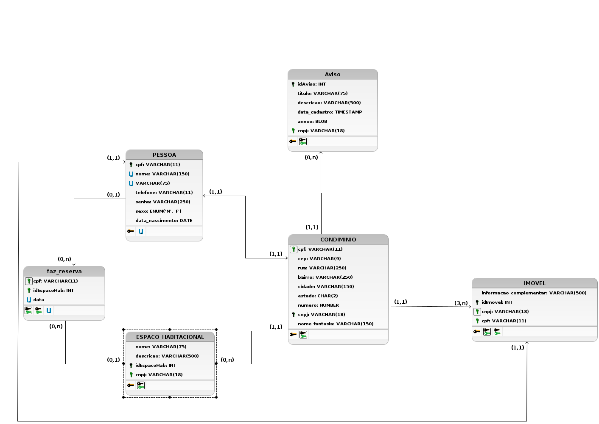

<h6 align='center'>Fonte: Autoria do grupo</h6>
<h6 align='left'>

OBS.: As versões anteriores podem ser encontradas no caminho /docs/assets/SGBD_Diagramas

</h6>

### 2.9. Tamanho e Performance
O projeto SpotHood e todos os seus arquivos e códigos somados não deverão ultrapassar os 1GB de armazenamento em uma máquina e, por se tratar de uma aplicação WEB e por ser focada em máquinas desktop, não é preciso nenhuma instalação por parte do usuário, apenas o seu acesso à internet.

### 2.10. Qualidade De Software
A qualidade de um software pode ser medida através de parâmetros definidos pela norma ISO/IEC 9126-1[4], sendo estes:

 - **Funcionalidades**:  Satisfação do que foi pedido
 - **Confiabilidade**: Capacidade do sistema de resistir a falhas e de se recuperar
 - **Usabilidade**: Facilidade de uso da aplicação pelo usuário
 - **Eficiência**: O desempenho de uma aplicação em cumprir o que lhe foi pedido
 - **Manutenção**: Facilidade em corrigir eventuais falhas que possam ocorrer
 - **Portabilidade**: Mobilidade da aplicação de ser utilizada em ambientes diferentes

Para cada aspecto desta norma, a aplicação SpotHood foi avaliada da seguinte forma:

| Aspecto | Avaliação |
| :-----: | :------- |
|**Funcionalidades**| O aplicativo atente as necessidade do usuário de acordo com os requisitos levandados. |
|**Confiabilidade**| O aplicativo fornece proteção a erros do usuário e possíveis falhas no sistema. |
|**Usabilidade**| A aplicação possui uma interface simples de se usar e um fluxo de uso leve. |
|**Eficiência**| A aplicação possui um tempo de carregamento das telas e componentes rápido |
|**Manutenção**| A aplicação se utiliza de tecnologias e padrões arquiteturais já conhecidos pela comunidade de software, então o material para consulta é vasto, permitindo maior facilidade em encontrar e corrigir falhas no projeto. |
|**Portabilidade**| O aplicativo pode ser usado em qualquer navegador independente do sistema operacional e dispositivo de acesso. |

## 3. Referências
[1] mozila.org. Introdução ao Django. Disponível em: <https://developer.mozilla.org/pt-BR/docs/Learn/Server-side/Django/Introduction>. Acesso em 14 de janeiro de 2023

[2] UFPR. Visões Arquiteturais. Disponível em: <https://www.inf.ufpr.br/silvia/ES/projeto/aulas/aula18.pdf>. Acesso em 24 de janeiro de 2023

[3] UFPE. Conceito: Visão de Processos. Disponível em: <https://www.cin.ufpe.br/~gta/rup-vc/core.base_rup/guidances/concepts/process_view_E3DD0B09.html>. Acesso em 26 de janeiro de 2023

[4] linhadecodigo. Quais são as Reais Características da Qualidade da NBR ISO/IEC 9126-1? Disponível em: <http://www.linhadecodigo.com.br/artigo/1444/quais-sao-as-reais-caracteristicas-da-qualidade-da-nbr-iso_iec-9126-1.aspx> Acesso em 24 de janeiro de 2023

[5] Unified Modelling Language, Fábio dos Reis. Disponível em: <http://www.bosontreinamentos.com.br/uml/o-que-e-uml-unified-modelling-language/>. Acessado em 27 de janeiro de 2023

[6] Django-React Software Architecture, Mahdia Aliyya. Disponível em: <https://mahdiaaliyya.medium.com/software-architecture-bb44325bf0cf>. Acessado em 28 de janeiro de 2023
