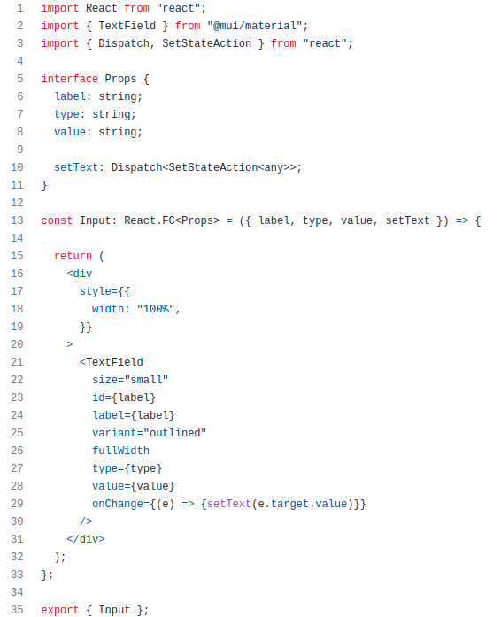
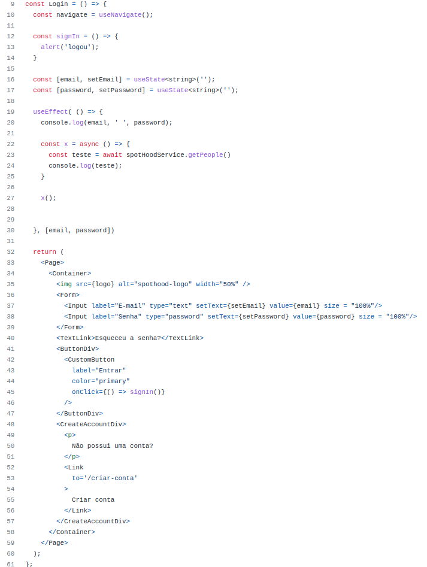

# 4.2. Módulo Reutilização de Software
## 1. Introdução
Este módulo do projeto tem a finalidade de apresentar componentes do projeto, os quais podem ser reaproveitados de diversas
formas, trazendo modularidade e simplicidade para seu desenvolvimento. Um dos principais objetivos é evidenciar módulos que
já estão prontos, para que não haja retrabalho no ato de construção de novos módulos. Dentre estes módulos, existem componentes
criados pelo próprio time e componentes gerados a partir de *frameworks*, os quais também se encaixam na proposta.

## 2. Conceito
A reutilização de código é a prática de usar código já existente em novos projetos de software. Isso pode ser feito de
várias maneiras, como incluindo bibliotecas de código aberto, reescrevendo funções e módulos existentes, ou mesmo copiando
e colando código. A reutilização de código pode economizar tempo e esforço, aumentar a qualidade do software e ajudar a 
manter a consistência em projetos grandes. No entanto, é importante garantir que o código reutilizado seja apropriado e
seguro para o novo uso e ser bem documentado.

Existem muitas fontes de informação sobre reutilização de código na engenharia de software, incluindo livros, artigos e 
sites na internet. Algumas referências populares incluem:

* "Code Complete" de Steve McConnell: Este livro é considerado um clássico na área de engenharia de software e aborda muitos
aspectos do desenvolvimento de software, incluindo a reutilização de código. 

* "Design Patterns: Elements of Reusable Object-Oriented Software" de Erich Gamma, Richard Helm, Ralph Johnson e John Vlissides:
Este livro apresenta 23 padrões de projeto comuns que podem ser reutilizados em muitos projetos de software diferentes."Refactoring: Improving the Design of Existing Code" de Martin Fowler: Este livro descreve técnicas para melhorar o design de código existente, incluindo a reutilização de código.
* "Software Reuse: Architecture, Process, and Organization for Business Success" de Ivar Jacobson, M. Griss, e P. Jonsson: 
Este livro aborda a reutilização de código a partir de uma perspectiva de negócios, discutindo como ela pode ser usada
para aumentar a eficiência e reduzir os custos."The Pragmatic Programmer" de Andrew Hunt e David Thomas: 
Este livro apresenta uma série de boas práticas para o desenvolvimento de software, incluindo a reutilização de código.

## 3. Metodologia
Foi feita uma análise de artefatos, códigos e padrões dos *frameworks* e, a partir disso, elabora-se o documento, compilando
as informações mais úteis e aplicáveis ao contexto do projeto. Estes cenários se fazem presentes em ambos ambientes de desenvolvimento:
back-end e front-end, assim como no banco de dados.

## 4. O que é a reutilização de Software?
A ideia da reutilização de software é evitar retrabalho no desenvolvimento de um novo projeto, sempre levando em consideração trabalhos anteriores, fazendo com que soluções previamente desenvolvidas sejam aproveitadas e implementadas em novos contextos.[1]

## 4.1. Reutilização do Front-End
### 4.1.1. Tecnologias, frameworks e bibliotecas
A realização do Front-end do **Spothood** foi o desenvolvido em Typescript, utilizando o *framework* **React** para desenvolver as interfaces de usuário. O desenvolvimento baseado em componentes permite a reutilização dos mesmos em diversas partes do código. Um componente após ser criado pode ser utilizado de diversas formas, tanto para compor uma página ou para criar componentes maiores, além da possibilidade de alterar seus parâmetros. 

Abaixo segue uma figura de exemplo real, utilizado em nosso código:

<center>



<h6>Figura 1: Exemplo de código de um componente feito em React</h6>

</center>

### 4.2.2 Análise do Front-End
A utilização do **React** é a de um *framework* caixa branca, evidenciado pela criação de componentes genéricos, como botões e caixas de texto, que podem ser reutilizados em diferentes cenários gerando resultados distintos. A alteração de funções específicas de componentes do mesmo tipo, assim como a criação de novos componentes utilizando outros já criados e até mesmo a alteração das propriedades de um componente, se assemelham muito com os conceitos de sobrescrita, herança e sobrecarga respectivamente, que são conceitos comumente associados a *frameworks* caixa branca, orientado a hot-spots.

Abaixo segue uma figura de exemplo real, utilizado em nosso código:

<center>



<h6>Figura 2: Exemplo de código onde o componente input é usado de duas formas distintas</h6>

</center>

## 5.1. Reutilização do Back-End
### 5.1.1 Tecnologias, frameworks e bibliotecas
O ambiente da aplicação **Spothood**, mais específico do Back-end, foi desenvolvido em Python, utilizando o *framework* **Django**.
Tal recurso entrega um solução modular e escalável para a produção de web API's, as quais utilizam de reutilização de código
para gerar seus *endpoints*, classes, views dentre outros.

Abaixo segue uma figura de exemplo real, utilizado em nosso código:

<center>


<h6>Figura 3: Exemplo de código reutilizável back-end spothood</h6>

</center>

> Utilizando a biblioteca **rest_framework** - original do Django - podemos aproveitar a função **routers**, a qual nos permite
> criar rotas de nossas **views**, nos padrões já validados pelo próprio *framework*.

## 6. Hot-spots e Frozen-spots
Identificar e projetar os hot-spots em um framework é uma das principais dificuldades para desenvolver projetos
reutilizáveis. Um framework para ter um alto grau de qualidade deve ter bons hot-spots para permitir futuras adaptações.
Frozen-spots definem a arquitetura geral de um sistema, ou seja, seus componentes básicos e os relacionamentos
entre eles[2].

* Abaixo segue um exemplo real de *hot-spot* utilizado em nosso projeto:
<center>


<h6>Figura 4: Exemplo em código de hot-spot utilizado no projeto.</h6>

</center>

Abaixo segue um exemplo real de *frozen-spot* utilizado em nosso projeto:

```python
"""
Django settings for spothood project.
Generated by 'django-admin startproject' using Django 4.1.4.
For more information on this file, see
https://docs.djangoproject.com/en/4.1/topics/settings/
For the full list of settings and their values, see
https://docs.djangoproject.com/en/4.1/ref/settings/
"""

from pathlib import Path
import os
import environ

env = environ.Env()
env.read_env('dev-env')

# Build paths inside the project like this: BASE_DIR / 'subdir'.
BASE_DIR = Path(__file__).resolve().parent.parent


# Quick-start development settings - unsuitable for production
# See https://docs.djangoproject.com/en/4.1/howto/deployment/checklist/

# SECURITY WARNING: keep the secret key used in production secret!
SECRET_KEY = 'django-insecure-+fzl#4&@o221mw9^5u70fj9#6wo(kk#)4u+9l7e-hnr1-_#+dy'

# SECURITY WARNING: don't run with debug turned on in production!
DEBUG = True

ALLOWED_HOSTS = []


# Application definition

INSTALLED_APPS = [
    'django.contrib.admin',
    'django.contrib.auth',
    'django.contrib.contenttypes',
    'django.contrib.sessions',
    'django.contrib.messages',
    'django.contrib.staticfiles',
    'rest_framework',
    'condominium',
    'corsheaders',
]

MIDDLEWARE = [
    'django.middleware.security.SecurityMiddleware',
    'django.contrib.sessions.middleware.SessionMiddleware',
    'django.middleware.common.CommonMiddleware',
    'django.middleware.csrf.CsrfViewMiddleware',
    'django.contrib.auth.middleware.AuthenticationMiddleware',
    'django.contrib.messages.middleware.MessageMiddleware',
    'django.middleware.clickjacking.XFrameOptionsMiddleware',
    'corsheaders.middleware.CorsMiddleware',
    'django.middleware.common.CommonMiddleware',
]

ROOT_URLCONF = 'spothood.urls'

TEMPLATES = [
    {
        'BACKEND': 'django.template.backends.django.DjangoTemplates',
        'DIRS': [os.path.join(BASE_DIR,'templates')],
        'APP_DIRS': True,
        'OPTIONS': {
            'context_processors': [
                'django.template.context_processors.debug',
                'django.template.context_processors.request',
                'django.contrib.auth.context_processors.auth',
                'django.contrib.messages.context_processors.messages',
            ],
        },
    },
]

WSGI_APPLICATION = 'spothood.wsgi.application'


# Database
# https://docs.djangoproject.com/en/4.1/ref/settings/#databases

DATABASES = {
    'default': {
        'ENGINE': 'django.db.backends.postgresql',
        'NAME': env('POSTGRES_DB'),
        'USER': env('POSTGRES_USER'),
        'PASSWORD': env('POSTGRES_PASSWORD'),
        'HOST': env('POSTGRES_HOST'),
        'PORT': env('POSTGRES_PORT')
    }
}

# DATABASES = {
#     'default': {
#         'ENGINE': 'django.db.backends.sqlite3',
#         'NAME': BASE_DIR / 'db.sqlite3',
#     }
# }


# Password validation
# https://docs.djangoproject.com/en/4.1/ref/settings/#auth-password-validators

AUTH_PASSWORD_VALIDATORS = [
    {
        'NAME': 'django.contrib.auth.password_validation.UserAttributeSimilarityValidator',
    },
    {
        'NAME': 'django.contrib.auth.password_validation.MinimumLengthValidator',
    },
    {
        'NAME': 'django.contrib.auth.password_validation.CommonPasswordValidator',
    },
    {
        'NAME': 'django.contrib.auth.password_validation.NumericPasswordValidator',
    },
]


# Internationalization
# https://docs.djangoproject.com/en/4.1/topics/i18n/

LANGUAGE_CODE = 'en-us'

TIME_ZONE = 'UTC'

USE_I18N = True

USE_TZ = True


# Static files (CSS, JavaScript, Images)
# https://docs.djangoproject.com/en/4.1/howto/static-files/

STATIC_URL = 'static/'

# Default primary key field type
# https://docs.djangoproject.com/en/4.1/ref/settings/#default-auto-field

DEFAULT_AUTO_FIELD = 'django.db.models.BigAutoField'

REST_FRAMEWORK = { 'DEFAULT_SCHEMA_CLASS': 'rest_framework.schemas.coreapi.AutoSchema' }

CORS_ALLOW_ALL_ORIGINS = True # If this is used then `CORS_ALLOWED_ORIGINS` will not have any effect
CORS_ALLOW_CREDENTIALS = True
CORS_ALLOWED_ORIGINS = [
    'http://localhost:3000',
] # If this is used, then not need to use `CORS_ALLOW_ALL_ORIGINS = True`
CORS_ALLOWED_ORIGIN_REGEXES = [
    'http://localhost:3000',
]
```

<h6 align='center'>Fonte: Projeto Spothood. [Link para o arquivo](https://github.com/UnBArqDsw2022-2/2022.2_G3_SpotHood/blob/main/app/backend/spothood/spothood/settings.py) </h6>

## 7. Referências
[1] Reutilização de software - Revista Engenharia de Software Magazine 39; Autor: DEVMEDIA; Data: 2011; Disponível em: https://www.devmedia.com.br/reutilizacao-de-software-revista-engenharia-de-software-magazine-39/21956#:~:text=A%20reutilização%20de%20software%20se,a%20qualidade%20e%20a%20produtividade Acessado em: 26/01/2023

[2] Padrões Arquiteturais, UFPR. Silvia Regina Vergilio. Disponível em: https://www.inf.ufpr.br/andrey/ci163/PadroesFrameworksAl.pdf. Acessado em: 27/01/2023.

## 8. Histórico de versões

| Versão | Mensagem                        | Autor        | Data       |
|--------|---------------------------------|--------------|------------|
| 1.0    | Adição de conteudo              | Mariana      | 26/01/2023 |
| 1.1    | Adição introdução e metodologia | Paulo        | 26/01/2023 |
| 1.2    | Adição hot-spot e frozen-spot   | Paulo e João | 27/01/2023 |
| 1.2    | Adição do framework do front-end e a análise feita dele | Vinicius | 28/01/2023 |
