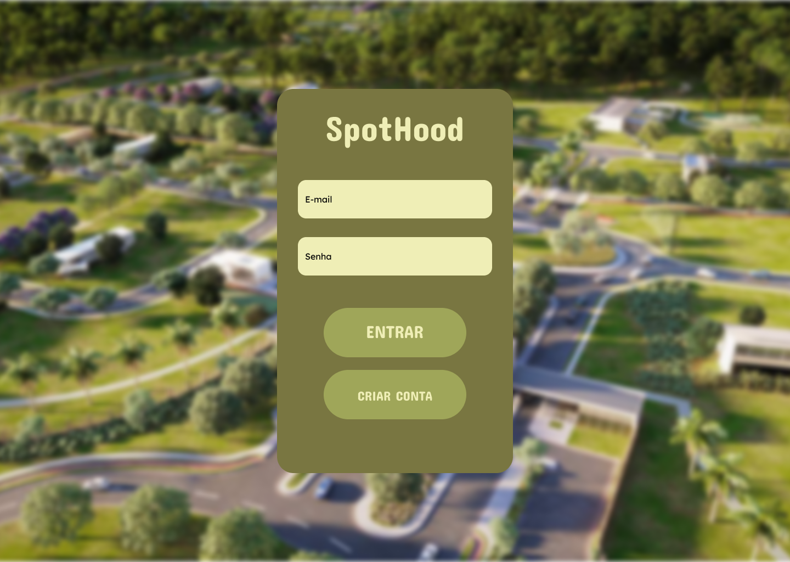

# Design Sprint

## 1. O que é design sprint ?

A [Design sprint](http://www.gv.com/sprint/) é um processo elaborado pela 
[Google Venture](https://www.gv.com/) para fornecer respostas satisfatórias à perguntas de negócios.
Ou seja, ela fornece um método para testar estratégias de negócios. Na página 
[Design sprint](http://www.gv.com/sprint/), são fornecidas breves instruções de como elaborar a sua
design sprint em cinco dias:

- Segunda:
  Mapeie o problema e selecione os pontos mais importantes.
- Terça:
  Esquematize e faça esboços de soluções que podem ser aplicadas ao problema.
- Quarta:
  Faça suas ideias se tornarem hipóteses testáveis.
- Quinta:
  Crie um protótipo de alta fidelidade.
- Sexta:
  Teste o protótipo e seus conceitos com pessoas reais.

Esta visão utilizando os dias da semana também pode ser expressa em quatro
fases:

- Unpack (segunda)
  Levantar e priorizar os principais requisitos.
- Sketch (terça)
  Elaborar soluções para o problema.
- Decision (quarta)
  Escolher as melhores ideias, mais testávei e prováveis de sanar o problema.
- Prototype (quinta e sexta): 
  Criar e validar o protótipo

## 2. Unpack

### 2.1. A escolha do projeto 

Neste momento foram pensados diversos modelos de negógicos possíveis, foram feitas pesquisas
sobre os [sites](https://pt.semrush.com/blog/top-100-sites-mais-visitados/) mais acessados no Brasil,
quais nichos de mercado seriam mais lucrativos ou possuiriam problemas importantes. 
Como resultado percebemos que as aplicações mais acessadas são redes sociais, sites de notícias,
apostas, varejo, entre outros. 

Ante esta percepção inicial houve um brainstorm para selecionar
o projeto. Dentre as diversas sugestões de caráter duvidoso, como a criação de um site de apostas, venda de Não NFTs e uma plataforma para venda de cursos genéricos, um dos membros mencionou
que em determinado momento havia pensado em uma aplicação para gerenciar condomínios, a relação entre
síndicos, moradores e funcionários. O grupo se sentiu engajado com a proposta, e esta temática foi escolhida.

### 2.2. Documentação 

Inicialmente um integrante pediu para mostrar um [vídeo](https://www.youtube.com/watch?v=rRd9lghTyww&t=2s&ab_channel=JovemNerd)
de humor do Jovem Nerd, que contava uma história da relação de um síndico com os moradores de um prédio. Isto ajudou a pensar
nos problemas da administração condominial e quais seriam as características iniciais das pessoas envolvidas. Por fim, abrimos
um arquivo compartilhado entre a equipe e colocamos as ideias tidas pelo time [brainstorm](1.1.5.Brainstorm.md).
Ademais, vale dizer que o [BPMN](../assets/diagram.png) explicitando o processo de criação do software também foi produzido nesta
etapa.

## 3. Sketch

### 3.1. Documentação 
[Rich Picture](Base/1.1.7.RichPicture.md) - É um desenho responsável por representar um situação.

[Plano de Gerenciamento de Riscos](Base/1.1.2.PlanoDeRiscos.md) - Um documento visa conduzir como será as atividades de Gerenciamento de Riscos deste projeto.

[Mapa Mental](Base/1.1.3.MapaMental.md) - Um artefato apresentado visa apresentar o que é o mapa mental.

[5W2H](Base/1.1.4.5w2h.md) - Com a finalidade de registrar de maneira organizada e planejada como serão efetuadas as ações e seus custos para a empresa.

[Brainstorm](Base/1.1.5.Brainstorm.md) - É uma das mais conhecidas técnicas de Elicitação de requisitos.

[Diagrama de Ishikawa](Base/1.1.6.Ishikawa.md) - É uma ferramenta usada para auxiliar na identificação de problemas.

## 4. Decision

Priorizamos os requisitos com base nas que tornariam nosso sistema único, visão um software que foca na relação de um [síndico](Base/1.1.8.GlossarioLexico.md#Síndico) com um morador.
Existem outros softwares que já fazem, por exemplo, a checagem da entrada e saida de moradores, mas essa sendo uma issue que já ocorre em outros aplicativos focamos nas issues que tornaram nosso software único.

Exemplo dos aplicativos: CondMais, CondominiumApp, etc;

### 4.1. Documentação 
Análise de mercado, yukio separou alguns aplicativos do mesmo nicho que o nosso.

[Backlog](Base/1.1.9.Backlog.md) - É uma lista priorizada de itens sobre os quais o Time de Desenvolvimento trabalhará no decorrer do projeto.

[Léxico](Base/1.1.8.GlossarioLexico.md) - Se trata de uma técnica que procura descrever os símbolos de uma linguagem.

## 5. Prototype

O protótipo foi realizado com a ferramenta Figma. Os requisitos definidos foram utilizados como base para criação das telas, com o intuito do projeto ser idealizado para que futuramente pudéssemos decidir quais funcionalidades mudar, manter ou remover.

<h6 align='center'>Figura 1: Tela de login na aplicação SpotHood.<h6/>

Após realizado o login, o usuário morador e o usuário síndico recebem acesso da aplicação. A seguir estão disponibilizados o fluxo do usuário morador e também do usuário síndico.

<iframe style="border: 1px solid rgba(0, 0, 0, 0.1);" width="800" height="450" src="https://www.figma.com/embed?embed_host=share&url=https%3A%2F%2Fwww.figma.com%2Fproto%2F6i9tVHd97dRlAt7YGt10NP%2FUntitled%3Fnode-id%3D4%253A50%26scaling%3Dscale-down%26page-id%3D1%253A17%26starting-point-node-id%3D4%253A50" allowfullscreen></iframe>

<iframe style="border: 1px solid rgba(0, 0, 0, 0.1);" width="800" height="450" src="https://www.figma.com/embed?embed_host=share&url=https%3A%2F%2Fwww.figma.com%2Fproto%2F6i9tVHd97dRlAt7YGt10NP%2FUntitled%3Fembed_host%3Dshare%26kind%3D%26node-id%3D4%253A533%26page-id%3D4%253A391%26scaling%3Dscale-down%26starting-point-node-id%3D4%253A533" allowfullscreen></iframe>

### 5.1. Documentação 

## 6. Histórico de versões

| Versão  |   Data   |                   Alteração                    | Participantes |
| :-----: | :------: | :--------------------------------------------: | :---------: |
|   1.0   | 15/11/22 |              Criação do documento              | João Henrique |
|   1.1   | 17/11/22 |  Explicitação dos subtópicos da design sprint  | João Henrique |
|   1.2   | 17/11/22 |  Adição do conteúdo de Sketch  | Mariana Rio |
