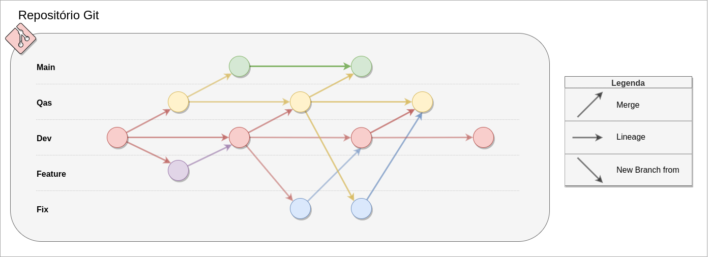

# Git Flow
Este documento tem o objetivo de consolidar padrões de uso do git no desenvolvimento de nossa aplicação.
***

## Sumário
 - [Motivação](./gitflow.md#motivação)
 - [Políticas de Contribuição](./gitflow.md#políticas-de-contribuição)
   - [Idioma](./gitflow.md#idioma)
   - [Ética](./gitflow.md#ética)
   - [Branches](./gitflow.md#branches)
     - [Fluxo de Branches](./gitflow.md#fluxo-de-branches)
     - [Exemplo](./gitflow.md#exemplo-do-fluxo-de-branches)
   - [Commits](./gitflow.md#commits)
     - [Commits Atômicos](./gitflow.md#commits-atômicos)
     - [Anatomia do Commit](./gitflow.md#anatomia-do-commit)
       - [Observações](./gitflow.md#observações)
       - [Exemplo](./gitflow.md#exemplo-de-commit)
   - [Pull Request](./gitflow.md#pull-request)
   - [Nomenclatura](./gitflow.md#nomenclatura)
 - [Histórico de Versões](./gitflow.md#histórico-de-versões)

***
## Motivação
Conforme nomeação do documento, neste projeto usaremos uma adaptação do padrão **git flow**. Este conceito tem seu fundamento
na organização de repositórios, atribuindo políticas de uso e restrições de segurança, sempre com objetivo de cumprir com
as práticas mais adequadas, observadas e aperfeiçoadas ao longo do tempo.

***
## Políticas de Contribuição
***
### Idioma
Por se tratar de um projeto univesitário do Brasil, por padrão, usaremos o idioma nativo, **Português**. Poŕem, sabe-se
que a área de engenharia de software possui muitos conteúdos e termos em outros idiomas, como o próprio *git flow*, portanto 
também será aceito o uso de **terminologias** no idioma **Inglês**. 

***
### Ética
O projeto espera do colaborador bom senso na escrita, além de não permitir a produção contribuições com linguagem ofensiva.
A proposta perpassa pela interação direta com a vivência e moradia de pessoas, portanto também assume-se o compromisso 
de não violar o respeito em qualquer aspecto, sobretudo étnico racial, religião e sexualidade.

***
### Branches
#### Fluxo de Branches
Para garantir um fluxo de trabalho contínuo e de forma padronizada, possibilitando o rastreamento das funcionalidades
desenvolvidas e facilitando o desenvolvimento contínuo. Os conceitos chave para implementação da estratégia serão:

* `Main`
Branch de **produção**, responsável por abrigar o código do último release. 

* `Qas`
Branch de **verificação**, representa uma etapa intermediária entre o processo de desenvolvimento e produção. Nesta etapa
são realizados os eventuais testes e revisões que antecedem o processo de deploy.

* `Dev`
Branch de **desenvolvimento**, tem a função e prioridade de ser a branch mais atualizada, a qual os desenvolvedores utilizaram
de ponto de partida para desenvolver as *features branches*.

* `Feature`
Branch de desenvolvimento de **funcionalidade**, representa a branch de trabalho sob uma determinada funcionalidade, tarefa, 
correção de bugs e afins.

* `Fix`
Branch de **correção**, possibilita os desenvolvedores de corrigirem eventuais funcionalidades quebradas. 

> É importante que a branch de funcionalidade seja criada seguindo o padrão: **feat#(número-da-issue)/nome-da-funcionalidade** e seja criada a partir da branch de 
desenvolvimento `Dev`.

> A branch de correção deve ser criada no padrão: **fix#(número-da-issue)/nome-da-funcionalidade** e originar-se da branch que apresentou 
> o erro, exceto se for a branch `Main`. Em caso de exceção, deve-se crira uma branch a partir de `Dev`.


#### Exemplo do fluxo de branches
Abaixo segue a ilustração do fluxo:

<center>



</center>
<h6 align="center">Figura 1: Fluxo de Branches<h6/>
<h6 align="center">Autor: SpotHood Team<h6/>

***
## Commits
As informações abaixo referem-se aos padrões de escrita de commits do nosso repositório:

### Commits Atômicos
Sempre dividir o trabalho em **pequenos e significativos commits**, de maneira que cada commit implemente apenas uma
funcionalidade.

### Anatomia do Commit
Na estrutura do padrão convencionado, possuímos as variáveis **tipo**, **número da issue**, **assunto** e **corpo**.
A anatomia do commit deve seguir o formato determinado abaixo:

```
[tipo](#número da issue): assunto 
> corpo
```

#### Observações
> As opções permitidas para o campo `tipo` são:
> - `feat`: nova funcionalidade
> - `docs`: relacionado a documentação
> - `refact`: refatoração  de código
> - `test`: adicionar/refatorar testes
> - `fix`: correções

> As regras para o campo `assunto` são:
> - Mensagem curta e sucinta
> - Todo texto deve estar sempre em letras minúsculas

> As regras para o campo `corpo` são:
> - Máximo de 100 caracteres
> - Detalhar minimamente as novas alterações
> - Deve conter `o que` e o `por que` foi feito

#### Exemplo de commit:
Abaixo segue um exemplo de commit feito no padrão do projeto:
```git
[refactor](#25): alterando classe financeiro  
Refatoração do método cadastrar boletos pois a execução estava muito lenta. 
```
***
## Pull Request
Por meio do processo de **pull request**, realizado no github, toda nova funcionalidade deve ser integrada à branch de
desenvolvimento, seguindo o fluxo `Feature -> Dev`.

Uma vez que a branch de desenvolvimento esteja com todos os artefatos necessários para se fazer deploy, deve-se criar um
pull request de `Dev -> Qas`.

A branch de validação (qas) deve ser **revisada por todos os membros antes de relizar-se o merge para a branch Main**. 
Desta forma pode-se adicionar mais uma camada de validação pré-deploy e conferir mais acertividade nas entregas. Após 
concluir a validação, 

> Dentre as atividades obrigatórias de um pull request, estão a **revisão em pares** da entrega e **ajuste de eventuais conflitos**. 

> O colaborador que abrir o pull request **não pode mergear o mesmo sem revisões de terceiros**.

Para publicar uma nova versão estável da aplicação na branch `master` é necessário realizar um **Pull Request** da branch `develop` para a `master`. Assim garantido a revisão da nova versão do código.

### Nomenclatura
Toda branch deve estar necessariamente estar relacionada a uma funcionalidade ou correção, logo a uma _Issue_. O nome da branch deve estar em INGLÊS seguindo o padrão:

- Para funcionalidades: `feat#(número-da-issue)/descrição-curta`
- Para correções: `fix#(número-da-issue)/descrição-curta`

Exemplo: `feat#24/diagrama-de-classes`

***
## Histórico de Versões

| Versão |    Data    |           Modificação           |                                                    Autor                                                    |
|:------:|:----------:|:-------------------------------:|:-----------------------------------------------------------------------------------------------------------:|
|  1.0   | 01/12/2022 | Criação do documento e diagrama | Paulo Gontijo |
